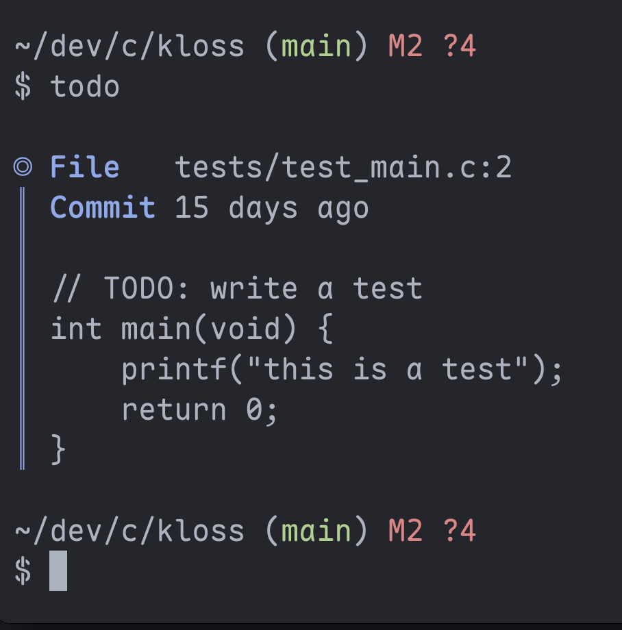

<h1 align="center">todo.py</h1>
  
<p align="center"><em>A search utility for TODO statements<br>in codebases.</em></p>
  
<p align="center">
    
  
</p>
  
<p align="center">
  <a href="#info">Info</a> •
  <a href="#install">Install</a> •
  <a href="#usage">Usage</a>
  <br>
  <a href="#screenshots">Screenshots</a> •
  <a href="#license">License</a>
</p>  
  
---
<div id="info"></div>
  
### Features
- User-configurable keyword search term (default: `TODO:`)
- Automatically track how long a task has been ignored
- Nerdfont support
  
### Requirements
- Python (3.10+)
- Git
  
---
<div id="install"></div>
  
## Install
  
### Download todo.py from the repo
  
``` terminal
curl -O https://raw.githubusercontent.com/simon-danielsson/todo.py/refs/heads/main/src/todo.py
chmod +x todo.py
mv todo.py ~/my_scripts
```
  
### Add a bash alias
  
``` bash
#!/usr/bin/env bash

alias todo="$HOME/my_scripts/todo.py"
```
  
---
<div id="usage"></div>
  
## Usage
  
``` terminal
Usage: todo [OPTIONS]

Options:
-k  <keyword>    Keyword to search for (default: "TODO:")
-c, --no-color   Disable color output (default: enabled)
-h, --help       Show this help message and exit
```
  
---
<div id="screenshots"></div>
   

    
---
<div id="license"></div>
  
## License
  
This project is licensed under the [MIT License](https://github.com/simon-danielsson/todo.py/blob/main/LICENSE).  
